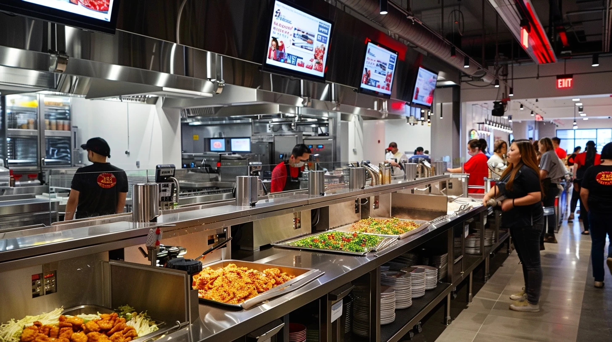
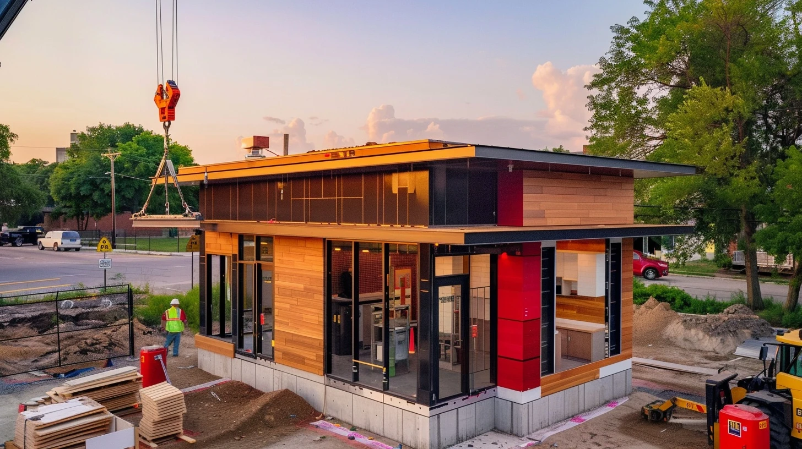
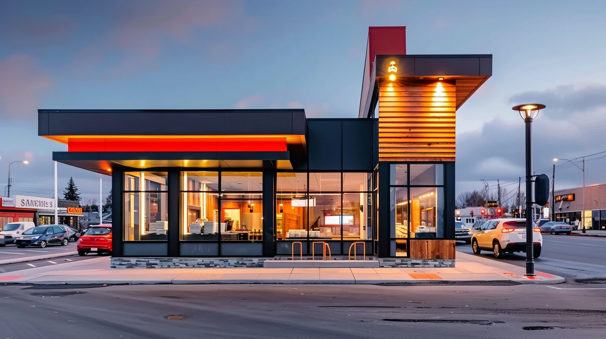
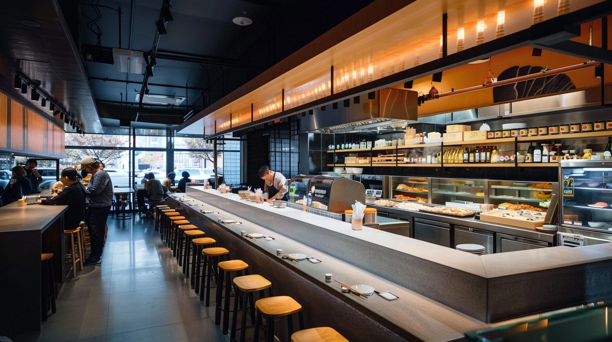
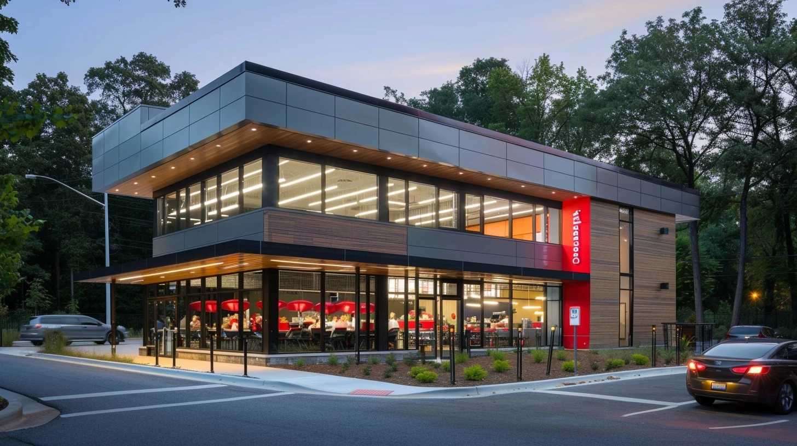

# Panda Operations Innovation
## A Peer-Benchmarked View of Where the Next Operating Margin Lives — and What Your Team Should Build First

**Prepared for:** James Ku, Chief Development Officer, Panda Restaurant Group
**Prepared by:** Brady Smallwood
**Date:** April 30, 2026
**Source corpus:** 14 deep research threads + 3 supplementary focus dossiers, 480+ cited public sources, ~600 pages of internal working notes
**Status:** Standalone synthesis — not a proposal

---

## How To Read This

This document is a synthesis. The full corpus behind it is large enough that a verbatim read is the wrong way to use it. I would skim the executive summary, jump to whichever of the seven binding constraints is most contested, and come back to team architecture at the end. The pages on the test kitchen — vectors, capex envelope, kill gates — are written to be useful inside a charter conversation if you decide to commission one.

Numbers cited in the body are pulled from public filings, peer earnings calls, vendor disclosures, and trade-press reporting from 2022–2026. Where Panda data is inferred from public proxies, I have flagged the inference. Where the source thread goes deeper than the page allows, I have pointed to it (DR-XX, SFDR-XXX) so you can ask for the underlying material at any depth you want.

The corpus is alive. If a single paragraph here is doing more work than you want to verify, that paragraph has somewhere between five and forty pages of underlying research that produced it.

---

# Executive Summary

The function you are standing up is the right venue, at the right moment, for a portfolio of operational gaps that are individually solvable and collectively worth high hundreds of millions of dollars annually. The work is real. The peer playbook on parts of it is mature; on the wok side, no peer has solved it yet, which is why the program matters.

  

    
$80–135M

    
Annual cost hidden in digital order accuracy

    
$2.7B digital revenue × an estimated 3–5 pp gap to peer best-in-class. The largest fixable opportunity in the portfolio. Single-fiscal-year deliverable.

  

  

    
$200M

    
PAW investment scale, peer-validated at zero scale

    
No peer — Chipotle, Sweetgreen, Miso, McDonald's, Chinese vendor ecosystem — has validated wok automation commercially. PAW is original R&D, not a capex purchase.

  

  

    
$795M–$1.34B

    
Combined addressable margin pool, 20-statement portfolio

    
Half is concentrated in five problems: labor productivity, digital accuracy, wok standardization, digital economics, format capital efficiency.

  

  

    
3.6x

    
SG&A ratio gap to Chipotle (structural, not solvable here)

    
8–10% vs. 4.2%. Mostly the cost of the 100% company-operated model. Innovation moves restaurant-level margin instead, unlocking $65–130M of absolute profit pool.

  

  

    
3 / 4 / 1+3

    
Test kitchen architecture: vectors / gates / sites

    
3 validation vectors (wok, digital accuracy, drive-thru). 4 gates with pre-registered kill criteria. 1 controlled test kitchen + 3 instrumented control stores. Sections 6–7.

  

The single substantive recommendation in this document — the rest is observation, benchmark, and option-mapping — is on team architecture. Staff for execution and for portfolio coordination, not just one. A small permanent core (program lead, test kitchen GM and Kitchen Director, data lead) paired with fractional or part-time strategy capacity through the first 6–12 months. Make permanent the parts that prove themselves; do not pre-commit to a permanent shape until the data is in. Section 8 details the capability mix, the sequence, and the cross-functional mechanisms that give the team traction on dependencies that sit outside the CDO mandate.

---

# The Operating Premise

## Why a coordinated portfolio, and why now

Panda's existing innovation model is not an accident. It mirrors what every QSR at $1B–$3B in system sales runs — local autonomy, ops-led optimization, function-by-function tech investment. Below ~$3B, this scales. The decision velocity of a competent functional executive is faster than any committee, and the dollar value of the missed dependencies is smaller than the cost of governance overhead.

The threshold at which this starts to break is empirically visible across the QSR set. Chipotle elevated cross-functional technology authority around $5B in revenue (Curt Garner promoted to CTO/CDO in 2015). Starbucks built the Tryer Center at ~$24B in revenue (announced 2018), but the predecessor structure predated it by a decade. McDonald's Speedee Labs has been the equipment-and-format R&D function since 2005 and was rebuilt in 2018. CFA's Innovation Center opened in 2019. Domino's centralized digital under the CEO around 2010 at ~$1.5B in revenue.

The pattern: every large-scale QSR that compounded over a decade put a coordinating function in seat by the time it reached Panda's current scale. Several put it in seat well before. The exceptions are not in the comp set anymore. Boston Market is the most often cited; the cautionary detail is that the strategic problems Boston Market failed to coordinate on (digital, format, kitchen ops) are exactly the surface area where Panda's portfolio currently sits.

This is not a claim that Panda is at structural risk. It is a claim that the marginal cost of an uncoordinated portfolio at this scale is real and quantifiable. Per the Phase 2 problem portfolio, the cumulative concept-to-pilot delay caused by ambiguous ownership is conservatively 12–18 months on initiatives that should be moving in 6–9. At a portfolio addressable value of ~$800M, that delay carries an opportunity cost in the $30–80M range annually (DR-03, DR-18).

## The four largest unowned dependencies

The cleanest restatement of the diagnosis is this: four dependencies in Panda's current innovation footprint do not have a single owner, and the operating leverage on each requires multiple functions cooperating.

  

    
01

    
Wok automation

    
Capital planning · Operations · Store design

    
PAW investment ($200M signal) sits between operations and capital planning. The labor productivity story it unlocks lives in operations. The cook-line workflow redesign it implies lives in store design.

  

  

    
02

    
Digital order accuracy

    
IT / digital · Operations · Store design

    
The technology problem (KDS, POS, makeline routing) lives in digital. The operational problem (order data → cook → bag → guest) lives in operations. The format problem (dedicated digital makelines) lives in store design.

  

  

    
03

    
GridPoint smart building

    
Facilities · Operations · Capital planning

    
Energy management is supply-chain-led today. Predictive maintenance is operations-led. Franchisee-facing dashboards are an open question. Capex prioritization against new-unit construction is finance-led.

  

  

    
04

    
Drive-thru throughput

    
Format · Labor · Technology · SOP

    
No single function can move the cars-per-hour number without three other functions cooperating on format, training, technology integration, and standard operating procedure.

  

Whatever the form factor, the function being created is portfolio coordination — not innovation invention. Someone has to own the calendar, set the quarterly portfolio, and have authority to call where the next dollar of capex goes. The team you are standing up is the natural home for that work. Format and store design already sit with you; the construction pipeline already sits with you; smart building deployment already runs through your facilities organization. Adding kitchen-side ops innovation, digital accuracy, and drive-thru throughput to the same coordinated portfolio extends the existing reach by adjacency rather than by building a new structure.

---

# Peer Innovation Operating Models

The shape of an innovation function is determined by what it is being asked to do. The peers prove this isn't tautological. Eight benchmarks, the structures they chose, and what they shipped:

| Company | Function shape | Reports to | Cycle time | Flagship output | What it failed at |
|---|---|---|---|---|---|
| Walmart | Store No. 8 (incubator), 2017–2024 | CEO | Multi-year | Drone delivery, shelf robots | Dismantled Jan 2024; venture model didn't scale |
| Starbucks | Tryer Center (Seattle, ~20 staff + rotation) | COO → CEO | 100-day fast track / 6–18mo equipment | Siren Craft System (1,160 stores) | No food-equipment validation |
| McDonald's | Speedee Labs (Chicago, ~50 staff, 21K sqft) | EVP Global CIO → CEO | 12–24mo food / 18–36mo equipment | Voice AI (twice; Apprente then Google Cloud) | Internal digital builds; multiple resets |
| Chipotle | Innovation & Technology + Cultivate Center | CTO → CEO | 4–12 week pilot waves | Hyphen makeline, Autocado, Chipotlane (700+ stores) | Robotics rollout slower than promised |
| Chick-fil-A | Embedded across ops + Innovation Center | COO/CEO | Continuous | Drive-thru excellence; franchise alignment | No standalone breakthrough innovation |
| Sweetgreen | Acquisition-driven (Spyce → Infinite Kitchen) | Chief Ops/CEO | Acquisition cycles | Infinite Kitchen (~7 stores, $60K+/day) | Margin still negative at parent level |
| Taco Bell | Live Más Ventures + Defy team | Chief Product & Growth | Variable | Defy autonomous ghost kitchen | Capex per unit very high; small footprint |
| Domino's | Embedded under CEO | CEO direct | Continuous | Pizza Tracker; AI order prediction; autonomous delivery | International digital lag |

  

    
Lesson 01

    
The successful long-cycle innovations are <strong>infrastructure, not robotics</strong>. Chipotle's biggest move in a decade was the second makeline — entirely human-staffed, drove peak throughput from ~80 to 120+ orders/hour. Starbucks' biggest move was Siren Craft, an espresso-workflow redesign with no robot. Robotics is a longer-cycle bet that may pay off but should not anchor the operating-margin story.

  

  

    
Lesson 02

    
The <strong>venture-incubator model has lost</strong>. Walmart Store No. 8 was the most ambitious centralized retail innovation org ever built and was wound down January 2024. The work it produced couldn't be transferred into the operating business at the velocity the operating business needed. Starbucks Tryer never set up that way — partner rotation pulls the operating business through Tryer, instead of pushing innovation out.

  

  

    
Lesson 03

    
Innovation that <strong>reports two layers down slows; that reports CEO-adjacent accelerates</strong>. The mechanism is mundane — capital allocation conflicts get resolved in the room rather than over email — but the velocity differential is consistent across the comp set.

  

## What is not in the comp set: a wok-cooking peer

Worth stating bluntly because it shapes everything downstream. There is no peer in the comp set that has solved Panda's specific kitchen problem. Starbucks does not validate hot food equipment. Chipotle's makeline robotics are laminar-flow assembly (bowls, salads). Sweetgreen's Spyce automation is bowl-class. McDonald's Speedee Labs has done extensive flat-top grill and fry work — no wok work. The Chinese vendor ecosystem that does claim wok automation has zero verified commercial QSR deployments outside of restricted Chinese-market deployments that cannot be independently validated.

The implication is structural. On wok, Panda is at the front of the curve, not the back. PAW is not a "buy and deploy" problem. It is original applied R&D, with all the timing, capital risk, and outcome uncertainty that implies. SFDR-103 covers this in detail; the executive summary version is in Section 6.

---

# Panda's Innovation Footprint Today

Panda's pipeline in 2023–2026 is more substantive than its public profile suggests. Visible artifacts:

  

    
2023 · Format

    
Panda Home prototype

    
Dripping Springs, TX · May 2023

    
Cultural-heritage interior, ~15% smaller dining room, expanded BOH, immersive drive-thru pictograms, enhanced digital pickup zone. Three years post-launch, no public expansion narrative.

  

  

    
2026 · Format

    
North Platte new format

    
North Platte, NE · March 2026

    
Freestanding, drive-thru + dine-in hybrid, expanded kitchen footprint. Outcome data not yet disclosed.

  

  

    
2024 · Smart Building

    
GridPoint deployment

    
~2,500 US locations · 18-month rollout

    
IoT energy management based on a 200-store pilot. 15–25% energy reduction, 3–5 year payback per industry-standard assumptions.

  

  

    
Active · Voice AI

    
SoundHound voice ordering

    
Drive-thru · 10K+ locations

    
~85% standalone accuracy; ~95% on human + AI hybrid in industry benchmarks.

  

  

    
R&D · Wok

    
Panda Auto Wok (PAW)

    
Internal program · $200M+ signal

    
Specific deployment configuration not public. The test kitchen is the validation venue.

  

  

    
Active · Beverage

    
Tea Bar integration

    
39+ locations and growing

    
Beverage-led footprint extension. Standalone unit economics not yet disclosed.

  

A reasonable read is that ~$500M–$1B of value creation is in flight across these initiatives. None of them are nothing. None of them are coordinated against each other on a stated cadence. That last sentence is what the team you are building solves.

## Ownership map (from public evidence + DR-03)

Three of these domains have clear owners. Three have ambiguous or implicit ownership. Two are cross-functional with no governance home. The unowned cells are the dependencies the team is being asked to coordinate.

| Domain | Apparent owner | Confidence |
|---|---|---|
| Store format & design | James Ku (CDO) | High |
| Real estate / pipeline | James Ku (CDO) | High |
| Smart building / facilities | Supply Chain VP | High |
| Kitchen / BOH ops | COO Jeff Wang (likely) | Medium |
| Digital ordering / app | Unnamed CTO or EVP Digital | Medium |
| Voice AI (drive-thru) | Vendor-led with ops partner | Medium |
| Menu innovation | Scattered, no clear owner | Low |
| Wok automation / PAW | Internal R&D, leadership unclear | Low |

---

# The KPI Gap Map

The full KPI table is reproduced in Appendix A. The summary view, isolated to gaps that materially shape the innovation portfolio:

  

    
Restaurant op margin

    

      
Panda 9–11%

      
Chipotle 15–18%

    

    
4–7 pp

  

  

    
SG&A as % of revenue

    

      
Panda 8–10%

      
Chipotle 4.2%

    

    
380–580 bps

  

  

    
Labor % of sales

    

      
Panda 27–29%

      
CFA 24–26%

    

    
100–500 bps

  

  

    
Digital order accuracy

    

      
Panda 88–91%

      
Chipotle 95%+

    

    
4–7 pp

  

  

    
Drive-thru orders/hour

    

      
Panda 140–160

      
CFA 180–200

    

    
25–40 OPH

  

  

    
Digital mix

    

      
Panda 35–40%

      
Sweetgreen 60–65%

    

    
8–25 pp

  

  

    
Time-to-open (TTO)

    

      
Panda 12–18mo

      
CFA 8–10mo

    

    
4–8 months

  

The pattern is consistent: Panda is competitive on absolute scale and digital penetration, lagging on cost structure and operational fidelity, conservative on growth velocity. None of the gaps individually are catastrophic. Several together define the addressable margin pool the team is being asked to capture.

A useful disaggregation: structural (very hard to close) vs. operational (closable). Structural is most of SG&A — the 100% company-operated model is a deliberate brand-control choice; that is not innovation's problem to solve. Operational is everything else, and it is large.

## Where the dollars concentrate

Five gaps explain ~$200–300M of annual addressable margin in pilot-realistic windows, with longer-horizon stretches reaching $500M+ on growth velocity.

  

    
$30–40M

    
Labor productivity

    
~$100M if fully closed, $30–40M realistic in 24-month pilot-to-scale. Source-of-gap is workflow + role design + peak-hour play-calling — not headcount. Validated peer playbook: Starbucks Siren Craft + Chipotle digital makeline. (DR-01, DR-05)

  

  

    
$80–135M

    
Digital order accuracy

    
Largest fixable opportunity. Cause is the kitchen translation layer — POS → KDS → makeline → bag — not technology. Peer playbook: Chipotle dedicated digital makeline; Taco Bell Defy ghost kitchen format isolation. (DR-04)

  

  

    
$5–15M

    
Drive-thru throughput

    
Per hundred high-volume units. CFA dual-lane + handheld order-takers + pull-forward zones (~150 cars/hr peak). Mobile channel segregation drops mobile wait times ~30%. (DR-08, DR-09)

  

  

    
$50–100M

    
Digital mix expansion

    
If mix moves 42% → 50%+ over 36 months. Two constraints: digital fulfillment infrastructure and loyalty platform leverage. (DR-02, DR-03, DR-04, DR-07)

  

  

    
$5–7M

    
Construction velocity

    
Per year at the current 123-unit cadence. Modular + AI scheduling compresses 30–40% of TTO at +2% per unit capex. (DR-12)

  

The remainder of the $795M–$1.34B portfolio sits in second-tier problems: kitchen automation roadmap, format innovation, GridPoint extension into predictive maintenance, franchisee transparency model, governance tightening.

---

# The Seven Binding Constraints, Ranked

The constraint ranking organizes the same evidence as the gap map but answers a different question — not "where is the dollar value" but "what stops the dollar value from being captured." The two views are complementary; the constraint view is more useful for charter design.

  

    
01

    
Structural · Park

    
SG&A cost structure

    
Innovation cannot solve this. 100% company-operated model + family governance overhead. The right escalation is to CFO conversation; restaurant-level margin is the lever this function moves.

  

  

    
02

    
Operational · Highest priority

    
Digital order accuracy

    
Single-fiscal-year achievable. Capex envelope: $200K–$400K per high-volume unit for a dedicated digital makeline; $3–5M total at top 10–15 stores. Path: SOP redesign at zero capex first, capex deployment second.

  

  

    
03

    
Operational

    
Labor productivity

    
Wok cooking is intrinsically labor-intensive. Workflow redesign reclaims the first 1.5 pp; automation reclaims the next. ~140% wok-chef turnover compounds the cost ($27–39M/yr replacement). Pre-prep batching, ergonomic deck redesign, sauce-prep protocols reclaim 100–140 bps with zero capex.

  

  

    
04

    
R&D · Unsolved

    
Kitchen automation (wok)

    
Honest target for any near-term pilot: 5–12% sustained, 15% stretch. Vendor claims above this number are unverified at commercial scale. PAW investment signals the choice has effectively been made; the test kitchen converts that choice from a procurement bet to a measurement program.

  

  

    
05

    
Operational

    
Construction velocity

    
Solvable inside the team's scope. CFA at 8–10mo TTO is the right benchmark. A "compressed open" protocol piloted in 3–5 high-velocity markets (TX, CA, CO) with measurement against baseline cohort is the clean path. (DR-12)

  

  

    
06

    
Format

    
Format conservatism

    
Panda Home and North Platte are good incremental designs. Neither is a frontier format. Dual-lane drive-thru (+16% throughput at CFA), vertical kitchen stacking (CFA Elevated, 2–3x throughput at compressed footprint), ghost-kitchen-adjacency (Taco Bell Defy) are the frontier moves.

  

  

    
07

    
Operational

    
Kitchen execution fidelity

    
Connects directly to constraint 02. The translation problem (digital order data → KDS → makeline → bag) sits at the intersection of digital, operations, and store design. Two patterns: dedicated digital makelines (Chipotle, Taco Bell Defy); shared makelines + KDS + computer vision (McDonald's, Agot AI, Vistry). Test kitchen running both side by side is the cleanest comparative study.

  

---

# The Test Kitchen as Operating Mechanism

A test kitchen is not the only way to validate operational change. The peer set offers four credible mechanisms, each with a specific failure mode:

  

    
Mechanism

    
Cost shape

    
Cycle

    
Cleanest causation?

  

  

    
Embedded pilot stores (Chipotle pre-Hyphen, Sweetgreen Infinite Kitchen)

    
Lower capex, higher live-P&L risk

    
Slower

    
No

  

  

    
Acquisition-driven validation (McDonald's Apprente / Dynamic Yield)

    
Capital-heavy

    
Fastest if target exists

    
Mixed

  

  

    
Centralized R&D facility (Tryer, Cultivate, Speedee)

    
Higher capex, decoupled from live P&L

    
Faster iteration

    
Yes

  

  

    
Vendor-led on-site pilots (the path PAW partly sits on)

    
Low Panda capex, high vendor dependence

    
Mixed track record

    
Mixed

  

For Panda's specific portfolio of three unsolved questions — wok automation, >97% digital accuracy, drive-thru throughput at wok-menu complexity — the centralized R&D facility is the only architecture that produces clean comparative data on all three simultaneously. The reason: two of the three (wok and drive-thru) have no validated peer model, and the third (accuracy) requires controlled instrumentation across the full order lifecycle.

The mechanism choice has knock-on effects. A test kitchen produces an operating asset (the facility), an organizational asset (the rotation pool of GMs cycled through), and a knowledge asset (kill-gate data and benchmark framework). All three transfer back into the operating business. The other three mechanisms produce one or two but not all three.

## The three validation vectors

  

    
Vector 01 · R&D-grade

    
Wok automation

    
No peer validation. Original applied R&D.

    
<strong>Honest target:</strong> 5–12% productivity lift. <strong>Stretch:</strong> 15%.

    
<strong>Sunk cost if killed at Gate 3:</strong> $500–800K

  

  

    
Vector 02 · Partial peer validation

    
Digital order accuracy at high volume

    
No peer sustains >97% at scale. Best-in-class CFA at ~96–97%.

    
<strong>Honest target:</strong> 95% at 40+ orders/hr. <strong>Stretch:</strong> >97%.

    
<strong>Sunk cost if killed at Gate 3:</strong> $300–500K

  

  

    
Vector 03 · Strong peer validation

    
Drive-thru throughput

    
CFA, Cane's, In-N-Out have proven the architecture.

    
<strong>Honest target:</strong> 3:10 avg / 96% accuracy. <strong>Stretch:</strong> &lt;3:00 / 97%.

    
<strong>Sunk cost if killed at Gate 3:</strong> $400–700K

  

Aggregate worst case if all three vectors are killed: $1.2–2.0M. Within the PAW R&D envelope; not catastrophic at enterprise scale, but to be named in the ROI conversation rather than discovered after the fact.

## Capex envelope, staffing, timeline

From SFDR-101 (peer test kitchen models) and SFDR-102 (greenfield QSR test kitchen capex/staffing/timeline benchmarks):

  

    
Footprint

    
3,500–5,500 sqft

    
Consistent with Chipotle Cultivate scope

  

  

    
Build-out cost

    
$1.65M–$4.15M

    
Hybrid (Scope C, recommended): $2.25–2.85M

  

  

    
Permanent FTE

    
2.5–3 (lean) to 6 (peer norm)

    
Lean target consistent with single-shot validation budget

  

  

    
Operator rotation

    
$60–90K / 6mo cycle

    
2–3 store GMs on 2-month secondments

  

  

    
Vendor on-site support

    
$150–300K

    
Wok automation + KDS vendors; not in main capex envelope

  

  

    
Control-store instrumentation

    
$150–250K

    
3 comparison stores, instrumentation only

  

  

    
Total all-in (Scope C)

    
$2.61M–$3.49M

    
Including rotation, vendor support, controls

  

  

    
Timeline

    
6–7 months

    
Aggressive vs. peer norm of 8–14 months

  

The largest capex line item, by SFDR-102 line-item benchmarking, is not equipment — it is drive-thru civil work (paving, canopy, menu boards, site egress), which can absorb $400–800K. Equipment is the second-largest, with custom wok robotics (12–26 week lead time) on the critical path. A Phase 0 Gate 1 at Week 4 implies long-lead equipment orders by Week 2 at the latest.

Permitting is the silent variable. California is the slowest state for ground-up commercial restaurant permits (14–20 weeks); Texas and Arizona are fastest (8–12 weeks). A test kitchen near Rosemead is logistically ideal but permit-costly; a Las Vegas / Phoenix / Austin location accelerates permitting by 4–8 weeks at the cost of HQ proximity.

---

# Kill Gates: Pre-Registered Failure Criteria

The single most important architectural choice in a test kitchen is whether the gates are advance gates or kill gates. Advance gates ask "is the project ready to move forward." Kill gates ask "has the project failed clearly enough that we should stop." The peer evidence — Starbucks Tryer's 60%+ kill rate at the regional pilot gate; Chipotle's pilot waves that kill more concepts than advance — is unambiguous: kill gates produce velocity, advance gates produce drift.

  

    
G1

    
Week 4

    
Charter & site selection

    
Pause-or-rescope

    
Site lease signed · Capex approved · Long-lead POs placed · Permanent FTE recruitment active

  

  
→

  

    
G2

    
Week 8

    
Design & permitting

    
Pause-or-extend

    
Permits on clear path · Design scope drift &lt;20% · Permanent FTE offers accepted

  

  
→

  

    
G3

    
Week 12

    
Construction & install

    
First real kill gate

    
Per-vector kill criteria pre-registered (see below)

  

  
→

  

    
G4

    
Week 16

    
Operational validation

    
Second real kill gate

    
Stretch criteria for enterprise rollout

  

## Per-vector kill criteria (G3 / G4)

| Vector | G3 kill (Week 12) | G4 kill (Week 16) | If killed |
|---|---|---|---|
| Wok | <5% lift OR >10% downtime OR safety incidents >2 | <5% sustained, >10% downtime | Disable PAW bay; continue with commercial wok range; capture learnings for internal R&D |
| Accuracy | Sustained <93% at 40+ orders/hr | <93% at any peak | Pause integration; revert to baseline KDS; separate effort on translation layer |
| Drive-thru | Avg order time >3:15 at peak | >3:15 sustained at peak | Review architecture assumptions; rescope before next phase |

If all three vectors clear stretch criteria, recommend full enterprise rollout program (Phase 5, separate scope). If one fails but two succeed, phase rollout of successes; kill or R&D-pivot the failure. If two or three fail, the test kitchen has done its job — the wrong investments are not made at scale, the learnings are captured, and the next round of bets is better-informed.

The governance that makes pre-registered kill criteria credible is not technical — it is political. Pre-registered criteria are visibly posted at the test kitchen site office. Gate decisions are made on data, not anecdote. The room making the call includes the program lead, the rollout sponsor (a designated peer in the operating function whose stores will receive the rollout), you, and a CFO representative. Quarterly board visibility on gate decisions ties the test kitchen back into the enterprise capital plan.

---

# Team Architecture

The team you are standing up has three jobs: run the test kitchen, coordinate the portfolio of innovation initiatives across digital / kitchen / construction / smart building, and produce data clean enough that capital allocation decisions get made on evidence rather than instinct. The structural questions are what the team contains, in what order it gets staffed, and how it gets traction on dependencies that sit outside the CDO mandate.

## The capability mix

Five capabilities, ranked by hire sequence. Each is named for what it does — not for whom it reports to.

  

    
01

    
Program leadership

    
Owns the portfolio cadence, the gate decisions, the kill criteria, the quarterly readout. The central role; every other capability serves the program.

    
Permanent — hired first

  

  

    
02

    
Kitchen / ops embed

    
Owns wok-side validation; partners with the operating function on the data path from cook line to bag handoff. Field operator background required.

    
Permanent — test kitchen GM + Kitchen Director

  

  

    
03

    
Digital fluency

    
Owns the accuracy program, KDS / POS / makeline integration, order-lifecycle instrumentation. Partners with the digital function rather than duplicating it.

    
Fractional or contract through 2026

  

  

    
04

    
Construction / format extension

    
Already inside your team. The question is whether to add capacity or rebalance the existing roster against the test kitchen build-out plus the dual-lane drive-thru retrofit pilot.

    
Existing — re-allocate or augment

  

  

    
05

    
Data and measurement

    
Owns instrumentation across the test kitchen and three control sites. Statistical rigor matters here; this is the role most often underspecified at peer functions.

    
Fractional or contract through 2026

  

## Permanent versus fractional staffing

Some of these capabilities are permanent hires from day one. Others can be fractional through 2026 with a 6 to 12-month re-evaluation.

  

    
Role

    
Form factor

    
Compensation envelope

  

  

    
VP / Head of Ops Innovation

    
Permanent

    
$200–300K base + bonus

  

  

    
Test Kitchen GM

    
Permanent

    
$130–180K + bonus

  

  

    
Test Kitchen Kitchen Director

    
Permanent

    
$110–150K + bonus

  

  

    
Data lead

    
Fractional / contract through 2026

    
$15–20K monthly fractional, or $140–180K permanent

  

  

    
Strategy / portfolio chair

    
Fractional 6–12 months

    
$50–75K monthly

  

The fractional pattern matters for two reasons. First, it preserves optionality on roles whose long-term scope is genuinely uncertain — the strategy chair role can be auditioned for two quarters before committing to a permanent shape. Second, it accelerates time-to-value: a fractional senior brings the playbook and the network on day one, where a permanent search would put the role in seat 4–6 months later.

## Cross-functional traction without owning every function

A team inside the CDO mandate drives change on dependencies in digital, kitchen ops, and supply chain through three mechanisms — none of which require those functions to report into yours.

  

    
Mechanism 01

    
Steering rhythm

    
Quarterly portfolio review attended by the digital lead, the COO's office, the supply chain VP, and a CFO representative. You chair because the team is yours; the agenda is jointly authored so each function commits to its piece of the portfolio in the room.

  

  

    
Mechanism 02

    
Shared instrumentation

    
When the test kitchen ships data on accuracy, throughput, or labor productivity, that data lives in the operating functions' KPI dashboards — not in a CDO silo. Your team produces the measurement; the operating function takes the credit when the number moves. The single most important norm to set early.

  

  

    
Mechanism 03

    
Sponsor pairs

    
For each major initiative (digital makeline pilot, drive-thru retrofit, GridPoint predictive maintenance extension), pair a member of your team with a named sponsor in the operating function. They co-own the rollout — your team brings the validation, the sponsor brings the operational authority to scale.

  

## Build-out sequence

  

    
Months 1–3

    
Stand-up

    <ul>
      <li>Program lead in seat (fractional bridge if permanent search is still running)</li>
      <li>Test kitchen GM and Kitchen Director identified, offers extended</li>
      <li>Data lead retained on contract</li>
      <li>Sponsor pairs named for each major initiative</li>
    </ul>
  

  

    
Months 4–6

    
Operate

    <ul>
      <li>Test kitchen permanent staff onboarded</li>
      <li>First quarterly portfolio review completed</li>
      <li>First three control sites instrumented</li>
    </ul>
  

  

    
Months 7–12

    
Decide

    <ul>
      <li>First kill-gate decisions made on test kitchen vectors</li>
      <li>Second quarterly portfolio review</li>
      <li>Decision on fractional-to-permanent transition for the strategy chair role</li>
    </ul>
  

What this team looks like at month 12: a permanent core of 4–5 staff plus a fractional or contract layer, a quarterly steering rhythm with three other function heads, three vectors of test kitchen data with pre-registered kill criteria, and a portfolio of named-sponsor initiatives where each rollout has a co-owner inside the operating function that will absorb it.

---

# A 90-Day Action Map

These items do not require a search firm, a SOW, or an external advisor. They are the things that, executed cleanly inside Panda's existing org, produce the data needed to commit on the test kitchen and on the team build-out.

  

    
Weeks 1–4

    
Visibility

    

      
<strong>Stand up an internal cross-functional readout</strong>, weekly, with you, the COO's office, the CTO/digital owner, the supply chain owner, and a CFO delegate. Standing agenda: portfolio status across the four largest dependencies. Goal is mapping, not deciding.

      
<strong>Commission a digital order accuracy baseline by channel</strong> (1P app, DoorDash, Uber Eats, Grubhub) at 50 representative units. Two-week measurement window. No capex. Input for the constraint-2 capex decision.

      
<strong>Audit the wok-chef turnover number</strong> system-wide and at the top 200 high-volume units. Compare to industry benchmark. Input for constraint-3 economics.

      
<strong>Name a single owner</strong> for each of the four unowned dependencies. The owner does not have to be a new hire; it can be an existing executive with the dependency added to scope.

    

  

  

    
Weeks 5–8

    
Calibration

    

      
<strong>First Innovation Portfolio review</strong> with the four dependency owners. Use the Section 4 KPI gap map as the dashboard. Single deliverable: ranked initiative list with owner, scope, measurable target.

      
<strong>Pilot the Starbucks Siren Craft "Peak Play Caller" role</strong> at 3–5 high-volume Panda units. Zero capex. Measure peak-hour OPH delta over four weeks. Cleanest fast-validation of the Constraint-3 workflow lever.

      
<strong>Decide on test kitchen scope</strong> (Scope A semi-automated, Scope B full robotics, Scope C hybrid). Recommended: Scope C. If proceeding, place long-lead equipment contingent POs.

      
<strong>Make the team architecture decision</strong> on permanent vs. fractional roles, or commit to running the recommended pattern for two quarters and re-evaluating.

    

  

  

    
Weeks 9–12

    
Commitment

    

      
<strong>If test kitchen confirmed:</strong> file site permits (CA timing dictates Week 9 file date for a Rosemead-area site), sign site lease, finalize Phase 0 charter with kill gates pre-registered.

      
<strong>If team architecture confirmed:</strong> identify and onboard the fractional strategy chair (or stand up the equivalent through your existing executive network). Permanent search for the program lead can run in parallel.

      
<strong>Publish the Panda Innovation Portfolio internally</strong> — quarterly cadence, named owners, kill criteria, expected investment, expected return. The act of publication is half the value; it converts ambiguous ownership into accountable ownership.

    

  

What this does not require: a new external advisor. The ninety-day map is mostly internal calibration. The decisions get made by Panda. The data needed is mostly already inside the company; the visibility cadence is the new artifact.

---

# Anti-Patterns: What Peer Failures Should Stop You From Building

Five things the comp set proves are wrong. Drawn from DR-01 through DR-14 and the SFDR-101–103 deep dives.

  

    
Do not build a venture-arm

    
<strong>Evidence:</strong> Walmart Store No. 8 (dismantled 2024). McDonald's IBM partnership (divested 2022).

    
<strong>Action:</strong> Embed innovation in the operating model; do not silo it. The test kitchen is decoupled from a live P&L for measurement reasons, but the rollout pathway is integrated into operations from day one.

  

  

    
Do not promise wok productivity lift above 15%

    
<strong>Evidence:</strong> Every peer that has tried makeline robotics has captured 5–15% sustainable productivity gain at scale. Chinese vendor claims of 25–40% wok productivity lift have zero verified commercial QSR deployments.

    
<strong>Action:</strong> A pilot targeting 5–12% lift with a 15% stretch is on-precedent. A pilot targeting >15% sells a number no peer has demonstrated.

  

  

    
Do not bundle automation capex with the accuracy program

    
<strong>Evidence:</strong> Chipotle's combined Autocado + Hyphen pilot (2023) had unclear attribution — which lever drove which metric.

    
<strong>Action:</strong> Three vectors at the test kitchen must be instrumented separately so causation is observable. Bundling makes the data unfalsifiable, which makes future capital allocation a faith argument rather than an evidence argument.

  

  

    
Do not run validation with fewer than three control sites

    
<strong>Evidence:</strong> McDonald's Siren validations and Chipotle's earliest Chipotlane prototypes both stumbled — single-unit results couldn't be cleanly attributed without a control cohort.

    
<strong>Action:</strong> One test kitchen + three instrumented Panda stores producing baseline data is the minimum credible architecture. $150–250K instrumentation; no capex changes at the controls.

  

  

    
Do not run voice AI as a Phase 1 experiment at the menu board

    
<strong>Evidence:</strong> McDonald's voice AI (2019 Apprente, then 2022 Google Cloud reset) and Starbucks personalized recommendation (2019, deprioritized) are both cautionary.

    
<strong>Action:</strong> Panda already has SoundHound at scale; that is the level of deployment to maintain. Adding a wok-menu-complexity voice AI experiment burns budget on a problem the comp set has not solved.

  

---

# The Decisions Only You Can Make

Five questions whose answers shape the entire subsequent program. Each has a default if unanswered, and the default in each case is the lower-velocity path.

  

    
01

    
What is the CEO's appetite for the team you are building?

    
Every internal innovation function eventually needs CEO awareness — capital, cross-functional alignment, board visibility. The 100-day window after a CEO transition is when you can propose the team's mandate as a clear, time-boxed hypothesis rather than a vague capability addition. The more specific the propose-it-and-measure-it framing, the easier it is for the CEO to back without committing to a permanent restructure.

  

  

    
02

    
Corporate-only innovation, or franchisee-inclusive?

    
Panda is largely company-operated, which removes the franchise capital co-funding gates that constrain McDonald's (DR-13). The implication is velocity advantage. The implication for franchisee adoption — to the extent franchisees exist in the model — is that transparency and incentive alignment (PS-17 in the problem portfolio) become prerequisites. The default if unanswered is corporate-only — faster but smaller.

  

  

    
03

    
How aggressive is the automation appetite?

    
A Scope A semi-automated test kitchen ($1.65–2.15M) and a Scope B full-robotics test kitchen ($3.15–4.15M) signal different things to vendors, recruits, and the board. Scope C ($2.25–2.85M hybrid) preserves optionality on PAW while still capturing the digital accuracy and drive-thru learnings cleanly. If the strategic intent is to lead the industry on wok automation, Scope C is correct. If the intent is to be a fast follower, embedded pilot stores are sufficient.

  

  

    
04

    
Will Panda close underperforming units, or commit to turnaround at all locations?

    
This question shapes the rollout architecture for any successful pilot. If willingness to close exists, innovation can target high-potential units only. If not, innovation must work at all maturity levels — harder, slower, less margin-accretive but produces a more resilient brand. Default is "no closures," the more conservative path.

  

  

    
05

    
How much capital can the team deploy in 2026–2027?

    
The portfolio of 20 problem statements ranges from zero-capex (workflow redesign, gate governance) to $5–10M (test kitchen, dedicated digital makelines, dual-lane drive-thru retrofits) to $50M+ (vertical-stack format pilot, ghost kitchen network, Tea Bar standalone economics). A $5M annual envelope vs. $20M vs. $50M changes realistic 24-month scope by 4x.

  

These five answers are the inputs to program design. Three of them (#2, #3, #4) sit cleanly inside the CDO mandate as you have publicly framed it. Sequencing the five questions deliberately — answering the three you own first, then bringing the two CEO-dependent questions to the new CEO with a position rather than a question — is the lowest-friction path.

---

# Innovation Lab — Top 5 Concepts

The five concepts below are drawn from a parallel innovation-workshop pass — roughly 30 candidate ideas, scored across labor impact, capex, throughput multiplier, and brand differentiation. The five featured here are the high-conviction physical and format moves where a CDO mandate maps directly to construction, kitchen design, and site decisions. Each is paired with a representative concept rendering — illustrative, not architectural. The full ranked workshop output (with second-tier concepts on inventory automation, predictive maintenance, ghost kitchens, voice AI, and others) is available on request.

  
  

    
Tier 1 · Score 4.1 · Wok automation

    
Wok Automation 2.0 — Botinkit Integration

    
<strong>Problem</strong>Kitchen labor is the binding constraint on growth. Wok-chef turnover is ~140% annually; wages have moved 30% in three years.

    
<strong>What</strong>Next-gen Botinkit Omni-class wok robots execute entire recipes autonomously — measured ingredient dispensing, AI-optimized heat curves, consistent wok hei. Target: reduce kitchen staff from 8 to 3 per location with no compromise on the wok-fired brand promise.

    
<strong>Why now</strong>Production-deployed in Asia. 30% ingredient loss reduction, 40% energy reduction, 2x throughput vs. manual. Panda's menu — Orange Chicken, Beijing Beef, Chow Mein — is structurally ideal: high-volume, repeatable recipes.

    
<strong>First move</strong>Visit Botinkit factory in Shenzhen; run a 5-store pilot with Omni systems instrumented against control sites.

  

  
  

    
Tier 1 · Score 4.2 · Construction velocity

    
Modular Restaurant Kit

    
<strong>Problem</strong>Construction is too slow and too expensive for the growth target. Traditional builds take 6 months; at 123 stores per year, weeks compound into millions.

    
<strong>What</strong>Prefab restaurant modules (kitchen pod, dining pod, drive-thru pod) manufactured off-site and assembled in 60 days. Kitchen module arrives with all equipment pre-installed and tested. Site work runs in parallel with module fabrication, not in series.

    
<strong>Why now</strong>Modular construction is 30–50% faster and 20–30% cheaper at scale. CFA, Starbucks, and Marriott have proven the architecture; no major QSR chain has standardized it. CFA's 8–10 month TTO benchmark is achievable inside this approach.

    
<strong>First move</strong>Partner with a modular construction firm (Falcon, Guerdon, or RAD). Design the kitchen-pod prototype. Test full assembly on one greenfield site.

  

  
  

    
Tier 1 · Score 4.4 · Format retrofit

    
Digital Lane Splitter

    
<strong>Problem</strong>The box was designed for dine-in, but 42% of revenue is digital. Mobile orders queue against walk-in customers on the same line; both channels lose.

    
<strong>What</strong>A second drive-thru lane dedicated to mobile-app pickup only. Pre-paid orders, sub-60-second handoff, no menu-board interaction. Retrofit into existing high-volume locations; engineered into all new builds.

    
<strong>Why now</strong>Chipotle Chipotlane proved the architecture (700+ stores, 10–15% sales lift). No Asian QSR chain has done this. First-mover in the category.

    
<strong>First move</strong>Identify 20 locations with the highest digital-order share. Design the retrofit package. Pilot at 5; measure throughput, accuracy, and incremental sales.

  

  
  

    
Tier 2 · Score 3.9 · New format

    
Panda Counter — Japanese-Inspired Small Format

    
<strong>Problem</strong>No format exists between "full Panda Express" and "food-court kiosk." Urban rents are prohibitive for full-format stores; dense markets are under-served.

    
<strong>What</strong>800 SF counter-only Panda. U-shaped counter seating (12–16 stools). Ticket-machine ordering at entry. Visible wok station behind the counter as kitchen theater. Self-serve water and tea. No tables. Twelve-minute average visit.

    
<strong>Why now</strong>Yoshinoya, Matsuya, Sukiya, and CoCo Ichibanya have run this model at scale across 5,000+ Japanese locations. Build cost lands at ~40% of full-format. No US QSR chain has adopted the architecture; first-mover advantage in dense urban cores, transit hubs, food halls.

    
<strong>First move</strong>Visit Tokyo for an operations study (Yoshinoya, CoCo Ichibanya). Design a Panda Counter prototype. Test in one dense urban market.

  

  
  

    
Tier 2 · Score 3.7 · Frontier format

    
Vertical Kitchen Concept

    
<strong>Problem</strong>In high-AUV urban markets, real-estate availability is the binding constraint on expansion. Conventional footprints don't fit; vertical is the only path.

    
<strong>What</strong>Kitchen stacked above ground level with dual drive-thru lanes passing underneath. 2–3x throughput on the same land footprint. Modeled on CFA Elevated (first units 2023–2024) and Yum China RGM 3.0.

    
<strong>Why now</strong>CFA proved the architecture (10–15 vertical units/year by 2025). No Asian QSR chain has followed. In high-land-cost markets (CA, NY, TX urban cores), vertical compresses per-unit land cost 30–40% while multiplying throughput.

    
<strong>First move</strong>Identify 5 highest-performing urban Panda locations where lot size constrains throughput. Commission an architecture study for vertical adaptation.

  

The remaining workshop output covers the second-tier concepts: ghost-kitchen insertion, demand-responsive labor scheduling, drive-thru voice AI, vertical kitchen variants, predictive equipment maintenance, trade-area cannibalization modeling, sustainable build standard, central commissary model, recipe intelligence platform, an international export kit, order-ahead lockers, and the Walmart-outparcel + DoorDash co-branded virtual-kitchen partnership angles. All are documented with scoring, evidence, and first-move detail; available on request.

---

# What Was Examined, What Wasn't

This synthesis represents 14 deep research threads (DR-01 through DR-14) and 3 supplementary focus dossiers (SFDR-101 on peer test kitchen models, SFDR-102 on greenfield QSR test kitchen capex/staffing/timeline benchmarks, SFDR-103 on peer learnings mapped to Panda's binding constraints). Combined source corpus: 480+ cited public sources, ~600 pages of internal working notes.

## Source corpus map

| Thread | Topic | Sources | Primary contribution |
|---|---|---|---|
| DR-01 | Ops innovation at Walmart, Starbucks, McDonald's | 43 | Big Three operating models; Store No. 8 failure mode |
| DR-02 | Ops innovation at Chick-fil-A, Chipotle, Taco Bell, Sweetgreen, Domino's | 40 | Peer comp set; franchise innovation adoption patterns |
| DR-03 | Panda's current decentralized footprint | 35+ | Ownership map; absence of unified cadence |
| DR-04 | Digital order accuracy root causes | 35+ | Channel-by-channel error decomposition; peer solution patterns |
| DR-05 | Labor productivity, automation, process redesign | 42 | Workflow lever evidence; turnover cost economics |
| DR-06 | Kitchen automation state-of-the-art (wok, makeline) | 35+ | Wok unsolved finding; viable vs. vaporware vendor map |
| DR-07 | Panda financials and KPI benchmarks | 30+ | Gap quantification; addressable margin pool math |
| DR-08 | Format innovation 2025–2026 frontier | 38 | Dual-lane, vertical stacking, ghost kitchen evidence |
| DR-09 | Drive-thru innovation at scale | 32 | CFA, Cane's, McDonald's benchmarks; SoundHound performance |
| DR-10 | Smart building, facilities tech | 114 | GridPoint extension into predictive maintenance + waste tracking |
| DR-11 | Site selection, AI trade area analysis | 30+ | Format capital efficiency support |
| DR-12 | QSR construction pipeline, modular, speed-to-open | 25+ | TTO compression math; CFA control benchmark |
| DR-13 | Cherng family governance; recent CEO transition | 30+ | Governance constraint analysis; lite franchising appetite |
| DR-14 | Ops innovation hiring market | 30+ | Fractional-to-permanent leadership patterns |
| SFDR-101 | Peer test kitchen models | 25+ | Tryer / Cultivate / Speedee benchmarks |
| SFDR-102 | Greenfield QSR test kitchen capex/staffing/timeline | 15+ | Cost-per-sqft, FTE ratios, equipment lead times |
| SFDR-103 | Peer learnings mapped to Panda's binding constraints | 15+ | What-not-to-do list; per-vector kill criteria |

## What was not examined

The corpus is public-source. Material that is non-public, non-discoverable, or operationally specific to Panda was not within scope of this research cycle:

- PAW current capability and roadmap. Internal Panda program; status, capex deployment to date, and validation milestones are non-public.
- Panda labor cost detail by station and by geography. Inferred from public proxies (DR-05, DR-07).
- Panda Home + North Platte unit economics. No public expansion narrative; North Platte too recent for outcome data.
- Cherng family-level decision velocity on innovation governance. Inferred from DR-13 and 2026 CEO-transition reporting.
- Franchisee-side data on innovation adoption appetite. Not public; covered as a knowledge gap in the synthesis library.
- Specifics of any active vendor relationships beyond what is publicly disclosed (SoundHound, GridPoint).

## Open questions only Panda can answer

Sixty-two open questions are catalogued in the knowledge-gap synthesis. The ten that most materially shape the analysis above:

1. Panda's baseline crew turnover rate by role cohort, and its correlation with order accuracy and customer satisfaction.
2. Panda's unit economics by format, and the cash-on-cash ROI threshold for innovation investments.
3. Whether there is a centralized technology roadmap, or if digital infrastructure is fragmented; current KDS vendor and deployment status.
4. Panda Home unit economics — strategically viable format or pilot dead-end.
5. Board risk tolerance for ops innovation pilots; prior failed innovation mandates that shape current constraints.
6. Permanent ops innovation role architecture; appetite for a fractional bridge.
7. Franchisee visibility into unit economics; appetite for operational changes requiring training or process redesign.
8. Capital constraints (annual capex for tech, equipment replacement cycle, franchisee capex appetite) and how these limit kitchen automation, drive-thru dualing, GridPoint extensions.
9. SG&A breakdown by function; whether there are corporate efficiency opportunities that could fund innovation.
10. How order accuracy is currently measured (by channel, location, menu item); executive visibility into the gap between digital placement and delivered accuracy.

The open questions are worth their own conversation. None of the recommendations in this synthesis change materially based on the answers — but the timeline and the capex envelope of any committed program will.

---

# Appendix A — KPI Benchmark Table

| Metric | Panda | Chipotle | CFA | Taco Bell | Sweetgreen | McDonald's | Starbucks | Domino's |
|---|---|---|---|---|---|---|---|---|
| AUV (TTM 2024) | $1.6M | $2.6M | $2.2M | $1.2M | $1.5M | $2.3M | $2.0M | $2.4M |
| Restaurant op margin | 9–11% | 15–18% | 14–16% | 10–12% | 2–4% | 12–14% | 18–20% | 16–18% |
| Labor % of sales | 27–29% | 26–28% | 24–26% | 26–28% | 32–35% | 25–27% | 23–25% | 14–16% |
| Capex per unit | $450–550K | $600–700K | $400–450K | $320–380K | $800K–1M | $1.5–2M | $700–800K | $1.2–1.5M |
| Payback period | 3.5–4.5y | 3–4y | 2.5–3.5y | 4–5y | 5+y | 6–8y | 4–5y | 3–3.5y |
| Digital mix | 35–40% | 50–55% | 45–50% | 42–48% | 60–65% | 48–52% | n/a | n/a |
| Order accuracy (median) | 91–93% | 94–96% | 94–96% | 92–94% | 93–95% | 91–93% | n/a | n/a |
| Digital order accuracy | 88–91% | 95%+ | 94%+ | 92–94% | 94–96% | 90–92% | n/a | n/a |
| Drive-thru OPH | 140–160 | 120–140 | 180–200 | 150–170 | n/a | 160–180 | n/a | n/a |
| Unit growth (3y CAGR) | 3–4% | 7–9% | 5–6% | 4–5% | 8–10% | 1–2% | n/a | n/a |
| Same-store sales | 4–6% | 8–12% | 5–7% | 3–5% | 10–15% | 2–4% | n/a | n/a |
| Innovation maturity (1–5) | 2–3 | 4–5 | 4 | 4 | 3–4 | 5 | 4–5 | 5 |

Sources: DR-04, DR-05, DR-07, DR-08, DR-09. Maturity rating is a qualitative composite of breadth-of-formats × tech-integration × innovation-cadence. Estimates use industry medians where Panda data is non-public.

---

# Appendix B — About This Research

The corpus underlying this whitepaper was built between April 11 and April 24, 2026, in two phases. Phase 1 (April 11–16) produced the company-and-people baseline that preceded the April 16 introductory call. Phase 2 (April 17–24) produced the 14 deep research threads and 3 SFDR focus dossiers this synthesis draws from.

Each deep research thread was scoped to a specific operational question, executed against public sources (SEC filings, earnings calls, investor presentations, trade-press reporting, vendor disclosures, academic publications, regulatory filings), and validated against at least two independent sources per material claim. Every paragraph in this whitepaper has a source thread it can be traced back to.

The 480+ source count understates the actual research volume. It counts cited sources only, not background reading, vendor interviews, or peer-company artifact analysis. The internal working corpus is approximately 600 pages of structured notes, problem-statement writeups, KPI benchmarks, and synthesis documents.

If any specific section above produces a question that the synthesis does not address, the underlying material almost certainly does. The path to it is the source-thread map in Section 12.

---

*End of synthesis. April 30, 2026.*
